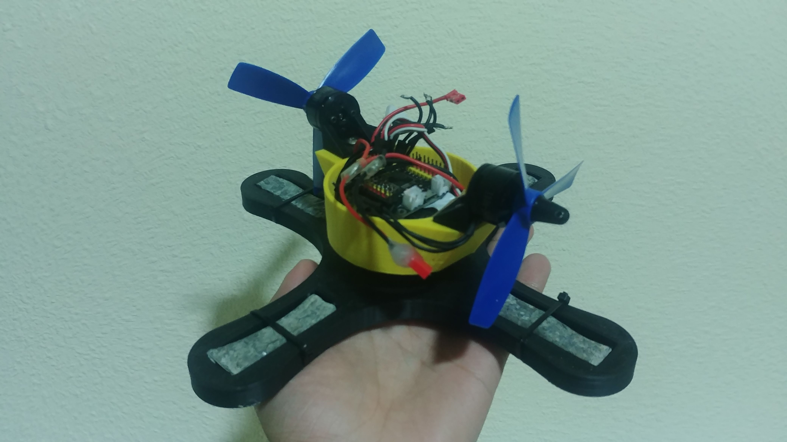
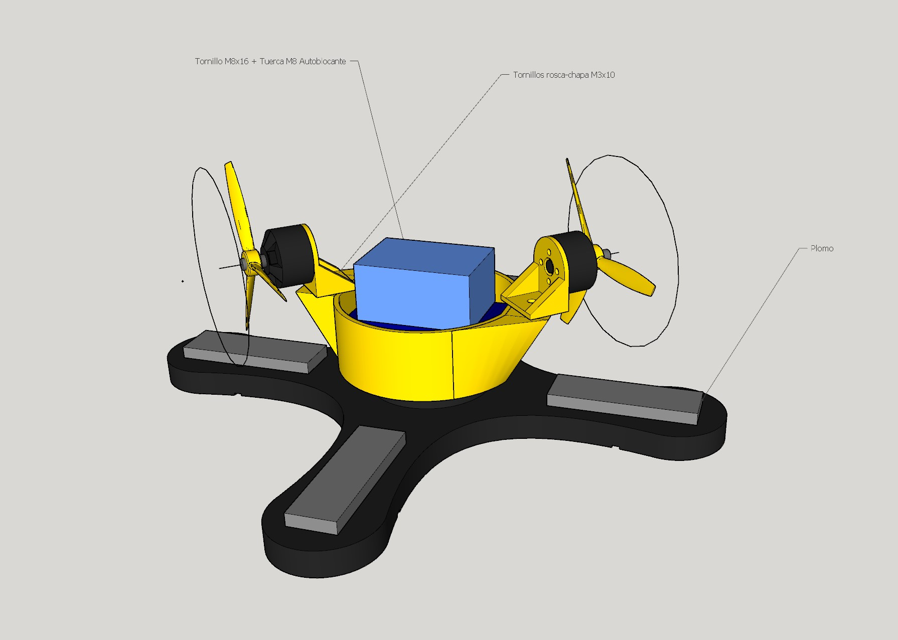

# BuffaloBot
Robot ganador de la categoría tiralatas para la competición de la Universidad de Vigo

## Hardware
- Arduino Nano *Strong* (placa cuadrada con los pines en "modo servo")
- ESC Genérico de 2s
- 2x Motores Brushless 1806 2400kv
- LiPo 2S ~500 mAh
- Tornillo autoblocante M8x16 + Tuerca autoblocante
- Chasis totalmente impreso en PLA
- *Sistema de cuerda* para iniciar

## Software
- Programado con Arduino IDE
- Se activan los motores mediante un sistema de cuerda (jumper que se suelta) durante unos segundos y se para durante un tiempo prudencial para apagarlo.